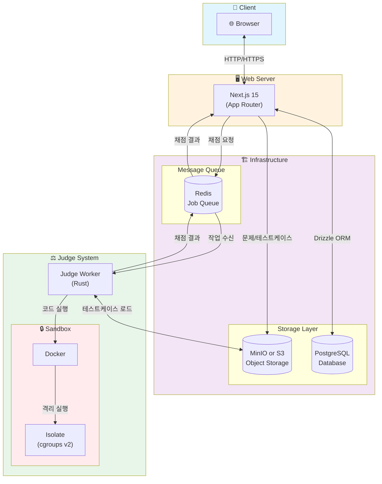

# ANA Online Judge (AOJ)

교내 프로그래밍 대회 개최, 알고리즘 열정 강화를 위한 온라인 저지 시스템

## 기술 스택



## 프로젝트 구조

```
ana-online-judge/
├── web/              # Next.js 웹 애플리케이션
├── judge/            # Rust 채점 서버
├── docker/           # Docker Compose 설정
└── PLAN.md           # 개발 계획
```

## 시작하기

### 사전 요구사항

- Node.js 18+
- pnpm
- Rust 1.75+
- Docker & Docker Compose

### 개발 환경 설정

1. **인프라 실행**

```bash
cd docker
docker compose up -d
```

2. **환경 변수 설정**

```bash
# Web
cp web/.env.example web/.env

# Judge
cp judge/.env.example judge/.env
```

3. **데이터베이스 마이그레이션**

```bash
cd web
pnpm drizzle-kit push
```

4. **웹 서버 실행**

```bash
cd web
pnpm dev
```

5. **Judge Worker 실행**

```bash
cd judge
cargo run
```

## 개발 명령어

### Web

```bash
cd web

# 개발 서버
pnpm dev

# 빌드
pnpm build

# Drizzle Studio (DB 관리 UI)
pnpm drizzle-kit studio

# 마이그레이션 생성
pnpm drizzle-kit generate

# 마이그레이션 적용
pnpm drizzle-kit push
```

### Judge

```bash
cd judge

# 개발 실행
cargo run

# 릴리스 빌드
cargo build --release

# 테스트
cargo test
```

## 라이선스

MIT
