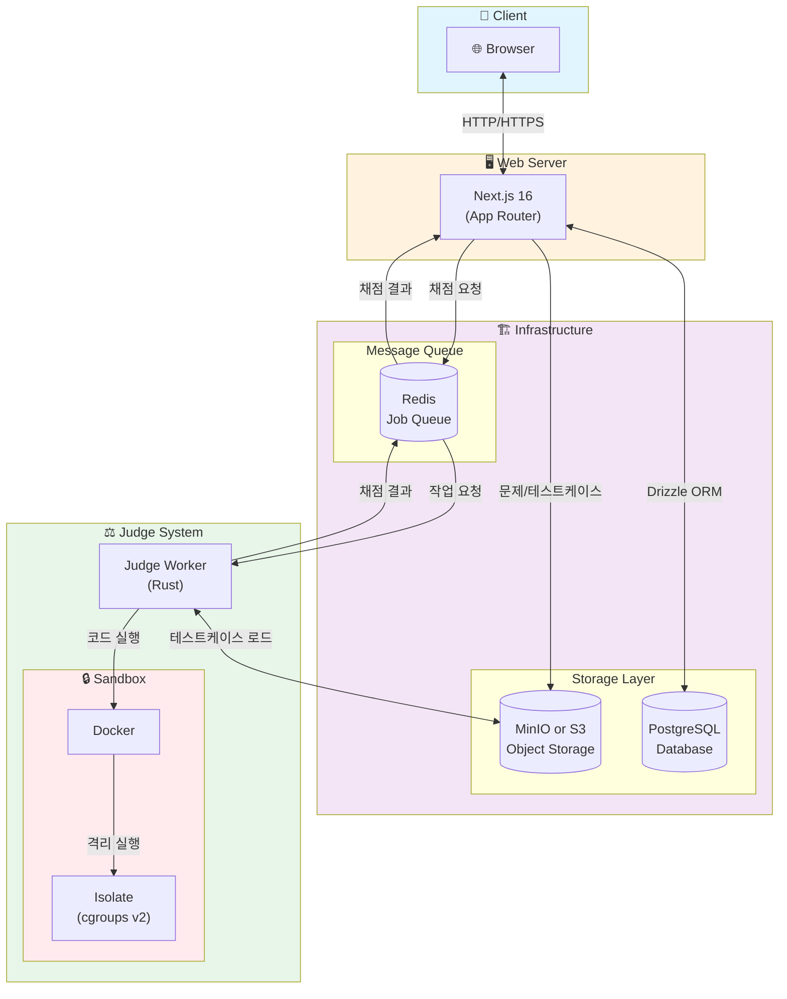

# ANA Online Judge (AOJ)

교내 프로그래밍 대회 개최, 알고리즘 강화를 위한 온라인 저지 시스템

## 주요 기능

### 채점 시스템

- **8개 언어 지원** — C, C++, Python, Java, Rust, Go, JavaScript, Text
- **다양한 문제 유형** — ICPC (표준 입출력 비교), 스페셜저지 (testlib.h 또는 Python 자체 채점기 기반), 인터렉티브 (Python 자체 채점기 기반), Anigma (다중 파일 제출, make 기반 빌드 및 채점 + 편집 거리 기반 점수 보너스)
- **샌드박스 실행** — isolate + cgroups v2 기반 격리 환경에서 안전하게 코드 실행
- **언어별 가중치** — Java, Python 등의 특정 언어에 시간 및 메모리 보너스 추가

### 대회

- **스코어보드 제공** — 기본 스코어보드, Spotboard 선택 가능
- **스코어보드 프리즈** — 대회 종료 N분 전부터 순위 비공개 처리
- **참가자 관리** — 사전 등록제, 대회 전용 계정 지원
- **공개/비공개 대회** — 접근 권한 설정

### 문제 & 제출

- **문제 목록** — 난이도, 정답률 등 필터링
- **제출 현황** — 판정 결과, 언어, 사용자별 필터
- **테스트케이스별 상세 결과** — 각 케이스의 판정과 채점기 메시지 확인

### 플레이그라운드

- **코드 실행 환경** — 모나코 에디터 기반 웹 IDE으로 개발 환경 설치가 어려운 사용자들에게 도움
- **stdin, stdout 기반 입출력 방법 제공**
- **멀티 파일 프로젝트 지원** — Makefile 기반 빌드 지원

### 관리자 대시보드

- **문제 관리** — 생성, 수정, 삭제, 테스트케이스 일괄 업로드
- **대회 관리** — 대회 생성, 문제 배정, 참가자 관리
- **사용자 관리** — 역할 지정, 계정 관리
- **파일 관리** — 업로드, 미리보기, 삭제 (파일 관리자 느낌 UI)
- **사이트 설정** — 회원가입 토글, Google OAuth 설정
- **API 키** — CLI 연동을 위한 API 키 발급 제공

### 인증 & 사용자

- **NextAuth v5** — 아이디/비밀번호 + Google OAuth 로그인
- **사용자 프로필** — 아바타, 자기소개, 개인 통계

### CLI

- `aoj ...`처럼 조작 가능한 CLI 툴 제공: 웹 사이트에 접속하지 않고 관리자 기능을 조작할 수 있음 (LLM에게 사이트 테스트 요청 가능)
- 서비스 레이어와 서버액션 레이어를 분리하여 CLI에서 동적으로 API 라우트를 받아올 수 있음 (CLI만을 위해서 기능 개발 시 추가로 생각해야 하는 내용 최소화)


## 지원 예정 기능

- **Codeforces Polygon과 유사한 문제 창작마당 제공**
- **사용자별 상세 권한 제공**: 문제 출제 권한, 대회 개최 권한 등등
- **문제 티어 기능 및 문제 평가 기능**

## 기술 스택



```mermaid
flowchart TB
    subgraph Client["👤 Client"]
        Browser["🌐 Browser"]
    end

    subgraph Web["🖥️ Web Server"]
        NextJS["Next.js 16<br/>(App Router)"]
    end

    subgraph Infrastructure["🏗️ Infrastructure"]
        subgraph Storage["Storage Layer"]
            PostgreSQL[(PostgreSQL<br/>Database)]
            MinIO[(MinIO or S3<br/>Object Storage)]
        end
        
        subgraph Queue["Message Queue"]
            Redis[(Redis<br/>Job Queue)]
        end
    end

    subgraph JudgeSystem["⚖️ Judge System"]
        JudgeWorker["Judge Worker<br/>(Rust)"]
        subgraph Sandbox["🔒 Sandbox"]
            Docker["Docker"]
            Isolate["Isolate<br/>(cgroups v2)"]
        end
    end

    Browser <-->|"HTTP/HTTPS"| NextJS
    NextJS <-->|"Drizzle ORM"| PostgreSQL
    NextJS -->|"문제/테스트케이스"| MinIO
    NextJS -->|"채점 요청"| Redis
    Redis -->|"채점 결과"| NextJS
    
    Redis -->|"작업 요청"| JudgeWorker
    JudgeWorker <-->|"테스트케이스 로드"| MinIO
    JudgeWorker -->|"채점 결과"| Redis
    JudgeWorker -->|"코드 실행"| Docker
    Docker -->|"격리 실행"| Isolate

    style Client fill:#e1f5fe
    style Web fill:#fff3e0
    style Infrastructure fill:#f3e5f5
    style JudgeSystem fill:#e8f5e9
    style Sandbox fill:#ffebee
```


## 프로젝트 구조

```
ana-online-judge/
├── web/                # Next.js 웹 애플리케이션
├── judge/              # Rust 채점 서버
├── cli/                # CLI 툴
```

## 시작하기

### 프로덕션 배포

#### 사전 요구사항

- Docker

1. **환경 변수 설정**

```bash
cp .env.example .env
```

1. **배포**

```bash
make prod-up
make prod-db-migrate
```

### 개발 환경 세팅

#### 사전 요구사항

- Node.js 18+
- pnpm
- Docker & Docker Compose

### 개발 환경 설정

1. **환경 변수 설정**

```bash
cp web/.env.example web/.env
```

1. **백엔드 인프라 실행 및 데이터베이스 마이그레이션**

```bash
make dev-up
make dev-db-migrate
```

1. **웹 서버 실행**

```bash
cd web
pnpm install
pnpm dev
```

1. (선택) **CLI 설치**

```bash
make cli
aoj -h
```

## 라이선스

MIT