# ANA Online Judge (AOJ)

교내 프로그래밍 대회 개최, 알고리즘 열정 강화를 위한 온라인 저지 시스템

## 기술 스택

```mermaid
flowchart TB
    subgraph Client["👤 Client"]
        Browser["🌐 Browser"]
    end

    subgraph Web["🖥️ Web Server"]
        NextJS["Next.js 15<br/>(App Router)"]
    end

    subgraph Infrastructure["🏗️ Infrastructure"]
        subgraph Storage["Storage Layer"]
            PostgreSQL[(PostgreSQL<br/>Database)]
            MinIO[(MinIO or S3<br/>Object Storage)]
        end
        
        subgraph Queue["Message Queue"]
            Redis[(Redis<br/>Job Queue)]
        end
    end

    subgraph JudgeSystem["⚖️ Judge System"]
        JudgeWorker["Judge Worker<br/>(Rust)"]
        subgraph Sandbox["🔒 Sandbox"]
            Docker["Docker"]
            Isolate["Isolate<br/>(cgroups v2)"]
        end
    end

    Browser <-->|"HTTP/HTTPS"| NextJS
    NextJS <-->|"Drizzle ORM"| PostgreSQL
    NextJS -->|"문제/테스트케이스"| MinIO
    NextJS -->|"채점 요청"| Redis
    Redis -->|"채점 결과"| NextJS
    
    Redis -->|"작업 요청"| JudgeWorker
    JudgeWorker <-->|"테스트케이스 로드"| MinIO
    JudgeWorker -->|"채점 결과"| Redis
    JudgeWorker -->|"코드 실행"| Docker
    Docker -->|"격리 실행"| Isolate

    style Client fill:#e1f5fe
    style Web fill:#fff3e0
    style Infrastructure fill:#f3e5f5
    style JudgeSystem fill:#e8f5e9
    style Sandbox fill:#ffebee
```

<p align="center">
  
</p>



## 프로젝트 구조

```
ana-online-judge/
├── web/              # Next.js 웹 애플리케이션
├── judge/            # Rust 채점 서버
```

## 시작하기

### 사전 요구사항

- Node.js 18+
- pnpm
- Rust 1.75+
- Docker & Docker Compose

### 개발 환경 설정

1. **백엔드 인프라 실행**

```bash
docker compose up -d
```

2. **환경 변수 설정**

```bash
cp web/.env.example web/.env
cp judge/.env.example judge/.env
```

3. **데이터베이스 마이그레이션**

```bash
cd web
pnpm db:push
```

4. **웹 서버 실행**

```bash
cd web
pnpm install
pnpm dev
```

## 라이선스

MIT
